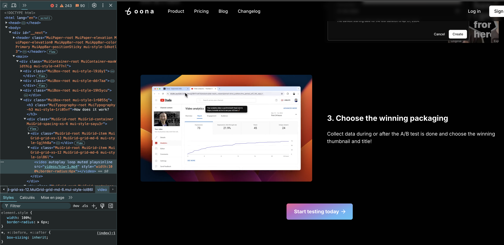

# Requirements:
- [x] remove actionner button if in the same page i change to another field or if i lose focus on the field
- [x] make a button to stop the generation on teh active button (corrrect/prompt)
- [x] reduce bundle size (i use preact now)
- [x] See why in gmail doens't work
- [x] optimize where to add the button, sometimes it overlapse cta buttons or not even in the correct place
- [x] Update filter of image on theme or background (dark/light). 
- [x] Store user input in sync data storage to ensure persistence even after closing the popup
- [] make a flag to disable the extension
- [] Fix the extension icon button

to present featurs in futur sites video autoplay
